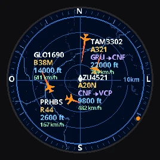
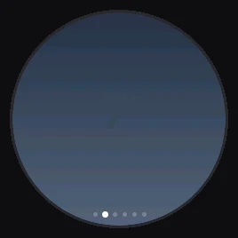
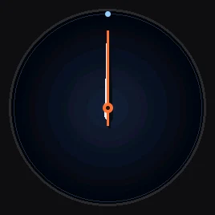
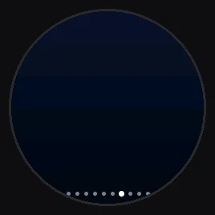
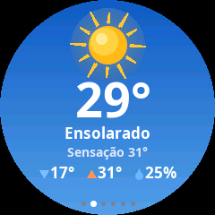
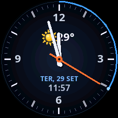
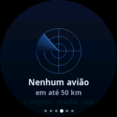
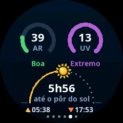
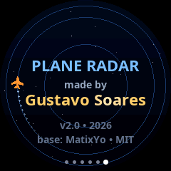

# ESP Plane Radar — by Gustavo Soares

<p align="center">
  
  
  
</p>

Radar de aviões **ao vivo** com o **mapa da sua região**, **clima animado**, **relógio**,
**avião mais próximo** e **qualidade do ar / UV / sol** — tudo numa telinha redonda de 1,28"
com um **ESP32-C3**. Sem cadastro e sem chave de API: tudo vem de serviços gratuitos.

> *English:* live ADS-B plane radar with a map of your area, animated weather, clock, nearest
> aircraft and air quality on a round 240×240 GC9A01 screen driven by an ESP32-C3. UI in Brazilian
> Portuguese. One-click browser installer below.

<p align="center">
  <a href="https://gustavofiladelfosoares-art.github.io/ESP-Plane-Radar/">
    
  </a>
  <br>
  <sub>Plugue a placa no computador (Chrome ou Edge), clique e pronto — sem programar nada.</sub>
</p>

---

## As telas

| | | |
|:-:|:-:|:-:|
| <br>**Radar** — mapa da região, aviões com voo, tipo, rota, altitude e velocidade | <br>**Clima** — céu animado: sol, nuvens chegando, chuva, tempestade, noite com estrelas | <br>**Relógio** — ponteiros suaves, data e temperatura |
| <br>**Avião mais próximo** — companhia, rota, direção para olhar, distância, altitude, velocidade | <br>**Ar, UV e sol** — qualidade do ar, índice UV e o caminho do sol no dia | <br>**Apresentação** |

Mais animações: [sol](docs/img/clima_sol.webp) · [nuvens](docs/img/clima_nuvens.webp) ·
[tempestade](docs/img/clima_tempestade.webp) · [noite](docs/img/clima_noite.webp) ·
[trocando o raio](docs/img/aviao_raio.webp)

### Na placa de verdade

Capturas feitas direto da tela da placa (pela USB), com dados reais:

<p align="center">
  
  
  
  
  
</p>

### O que aparece no radar

- **Mapa** da sua região ao fundo (estradas, rios e áreas urbanas), montado pela própria placa
  e guardado na memória — se você mudar a localização, ele é refeito sozinho.
- **Zoom**: 5 → 10 → 15 → 25 → 50 → 100 km.
- **Etiquetas** conforme o zoom, para não poluir a tela:

  | Zoom | Etiqueta |
  |------|----------|
  | 100 km | voo + tipo (ex.: `TAM3302` / `A321`) |
  | 50 km | + altitude |
  | até 25 km | + rota (ex.: `CNF → VCP`) + velocidade |

- **Bolinhas laranja na borda** = aviões fora do zoom atual, na direção certa — afaste o zoom e eles aparecem.
- **Pistas dos grandes aeroportos** desenhadas no mapa.
- **Varredura girando** (opcional, liga/desliga no celular).

---

## Peças

| Peça | Observação |
|------|------------|
| **ESP32-C3 Super Mini** | com USB-C |
| **Tela redonda 1,28" GC9A01** (240×240, SPI) | módulo comum de 7–8 pinos |
| Cabo USB-C **de dados** | muitos cabos só carregam |
| Caixinha / suporte | opcional (impressão 3D) |

### Ligação (tela → ESP32-C3)

| Tela | ESP32-C3 |
|------|----------|
| VCC | 3V3 |
| GND | GND |
| SCL | GPIO4 |
| SDA | GPIO3 |
| **DC** | **GPIO10** (montagem original) **ou GPIO2** (algumas unidades prontas) |
| CS | GPIO1 |
| RST | GPIO0 |

Existem **duas versões do firmware**, só por causa do fio **DC**. Se a tela ficar **preta com um
brilho fraco**, instale a outra versão.

---

## Instalar

### Pelo navegador (mais fácil)

1. Abra o **[instalador](https://gustavofiladelfosoares-art.github.io/ESP-Plane-Radar/)** no **Chrome** ou **Edge** (computador).
2. Conecte a placa, clique em **Instalar** na versão certa (DC no GPIO10 ou no GPIO2) e escolha a porta.
3. Se a placa não aparecer: segure **BOOT**, aperte e solte **RESET**, solte **BOOT** e tente de novo.

### Manual

Baixe o `.bin` da versão certa em **[Releases](../../releases/latest)** (ou em [`docs/firmware/`](docs/firmware/))
e grave no endereço **0x0**:

```bash
pip install esptool
esptool --chip esp32c3 --port /dev/cu.usbmodem101 write-flash 0x0 esp-plane-radar-dc10.bin
```

(No Windows a porta é algo como `COM3`.) Também dá para usar o
[ESP Web Flasher](https://espressif.github.io/esptool-js/) com o arquivo no endereço `0x0`.

---

## Configurar (pelo celular)

1. Na primeira vez a tela mostra **“Configurar Wi-Fi”**. No celular, entre na rede **`PlaneRadar-Setup`**.
2. Abra **`http://192.168.4.1`** (normalmente abre sozinho) → **Configurar Wi-Fi**.
3. Escolha a sua rede, digite a senha e preencha **latitude** e **longitude**
   (no Google Maps: segure o dedo no lugar e copie os números, ex.: `-19.919100, -43.938600`).
4. Salve. Tudo fica gravado na placa — pode desligar da tomada à vontade.

Depois, com o celular no mesmo Wi-Fi, abra **`http://plane-radar.local`** → **Localização e opções** para mudar:

- latitude / longitude
- distâncias em milhas
- pistas dos aeroportos
- **varredura girando no radar** (liga/desliga)
- **corrigir cores** (se vermelho e azul aparecerem trocados na sua tela)

## Botão BOOT

| Gesto | Ação |
|-------|------|
| **Toque** | Próxima tela |
| **Dois toques** | No radar: muda o zoom · No “avião mais próximo”: muda o raio (5 → 10 → 20 → 50 km) |
| **Segurar 3 s** | Apaga o Wi-Fi e volta para a configuração |

---

## Compilar o código

Precisa do [PlatformIO](https://platformio.org/):

```bash
pio run -e supermini -t upload        # tela com DC no GPIO10 (montagem original)
pio run -e supermini-dc2 -t upload    # tela com DC no GPIO2
pio run -e supermini -t merge         # gera o .bin único (firmware-merged.bin, endereço 0x0)
```

Configurações de hardware e comportamento ficam em [`include/config.h`](include/config.h).

### Simulador no computador

As telas podem ser vistas no Mac/Linux **sem a placa** — o simulador roda o mesmo código de
desenho e gera as animações (precisa do SDL2: `brew install sdl2`):

```bash
make -C sim preview        # gera sim/out/preview.html
```

### Tela preta?

`pio run -e screentest -t upload` grava um programa que testa as ligações mais comuns da tela,
uma por vez, mostrando cores e um número grande. O número que aparecer indica a ligação certa.

---

## Como funciona (resumo técnico)

- **Duas tarefas**: a interface desenha as animações; uma tarefa de rede busca os dados em
  segundo plano (aviões a cada 3 s, clima a cada 10 min, ar/UV a cada 30 min).
- A tela é desenhada **em duas metades** com um buffer de 57 KB — sobra memória para as conexões HTTPS.
- O ESP32-C3 **não tem FPU**, então os desenhos usam triângulos e contas inteiras sempre que possível.
- O mapa é montado a partir de imagens de mapa (JPEG) classificadas em água / cidade / estrada
  e guardado na flash (lido direto da memória, sem gastar RAM).
- Textos com acento usam fontes Noto Sans geradas por [`scripts/make_vlw.py`](scripts/make_vlw.py).

## Dados e créditos

- **Projeto original:** [ESP32-Plane-Radar](https://github.com/MatixYo/ESP32-Plane-Radar) por **MatixYo** (MIT) — o radar e a ideia base.
- **Aviões:** [adsb.fi](https://opendata.adsb.fi/) · **Rotas:** [adsbdb](https://www.adsbdb.com/)
- **Clima, ar e UV:** [Open-Meteo](https://open-meteo.com/)
- **Mapa:** Esri World Dark Gray Base — © Esri, HERE, Garmin, © OpenStreetMap contributors
- **Bibliotecas:** [LovyanGFX](https://github.com/lovyan03/LovyanGFX), [WiFiManager](https://github.com/tzapu/WiFiManager), [ArduinoJson](https://github.com/bblanchon/ArduinoJson)
- **Fontes:** Noto Sans (SIL Open Font License — [`data/fonts/OFL.txt`](data/fonts/OFL.txt))

## Licença

MIT — veja [`LICENSE`](LICENSE). Copyright © 2026 MatixYo (projeto original) e © 2026 Gustavo Soares (esta versão).
