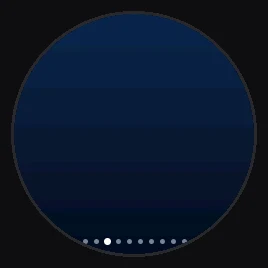
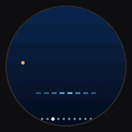
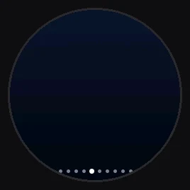
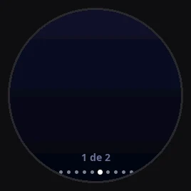
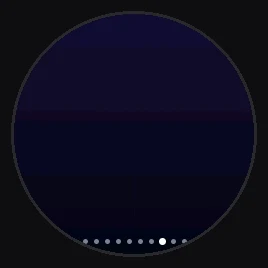
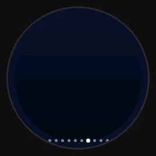
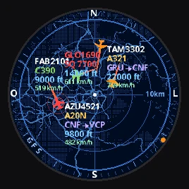
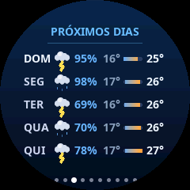
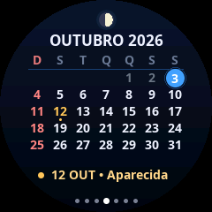
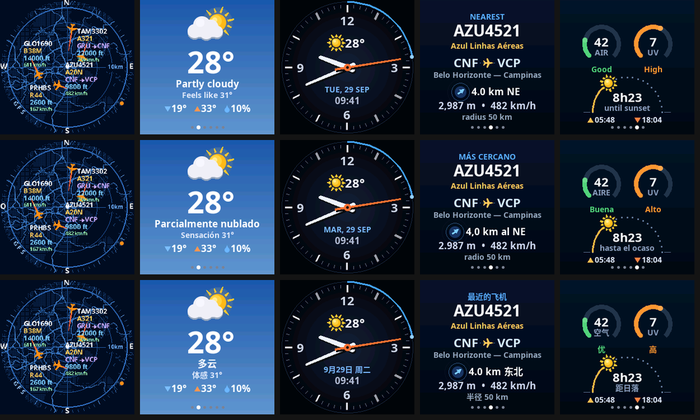

# ESP Plane Radar — by Gustavo Soares

<p align="center">
  
  
  
</p>

Radar de aviões **ao vivo** com o **mapa da sua região**, **clima animado** com **previsão de
5 dias e 12 horas**, **relógio** com modo noite, **calendário com feriados**, **sua Google Agenda**,
**avião mais próximo** com **alerta quando passa por cima**, **resumo do dia no céu** e
**qualidade do ar / UV / sol** — tudo numa telinha redonda de 1,28" com um **ESP32-C3**.
Sem cadastro e sem chave de API: tudo vem de serviços gratuitos.

> *English:* live ADS-B plane radar with a map of your area, animated weather with 5-day and
> 12-hour forecast, clock with night dimming, calendar, Google Calendar agenda, nearest aircraft
> with overhead alerts, emergency highlighting, daily sky stats and air quality on a round
> 240×240 GC9A01 screen driven by an ESP32-C3. Screens in
> Portuguese, English, Spanish or Chinese. One-click browser installer below.

<p align="center">
  <a href="https://gustavofiladelfosoares-art.github.io/ESP-Plane-Radar/">
    
  </a>
  <br>
  <sub>Plugue a placa no computador (Chrome ou Edge), clique e pronto — sem programar nada.</sub>
</p>

---

## As telas

| | | |
|:-:|:-:|:-:|
| <br>**Radar** — mapa da região, aviões com voo, tipo, rota, altitude e velocidade | <br>**Clima** — céu animado: sol, nuvens chegando, chuva, tempestade, noite com estrelas | <br>**Próximos 5 dias** — ícones animados, chance de chuva e mínima/máxima |
| <br>**Próximas 12 horas** — curva de temperatura e barras de chuva | <br>**Relógio** — ponteiros suaves, data e temperatura | <br>**Calendário** — mês, hoje em destaque, feriados e fase da lua |
| <br>**Agenda** — compromissos e tarefas de hoje da sua Google Agenda | <br>**Avião mais próximo** — rota, direção para olhar, altitude em metros e pés | <br>**Hoje no céu** — quantos aviões passaram, o mais alto, o mais rápido… |
| <br>**Alerta “sobre você!”** — quando um avião passa bem perto | <br>**Emergência** — avião com código 7700/7600/7500 pisca em vermelho; militares em verde | <br>**Ar, UV e sol** — qualidade do ar, índice UV e o caminho do sol |

Mais animações: [sol](docs/img/clima_sol.webp) · [nuvens](docs/img/clima_nuvens.webp) ·
[tempestade](docs/img/clima_tempestade.webp) · [noite](docs/img/clima_noite.webp) ·
[trocando o raio](docs/img/aviao_raio.webp) · [emergência na tela do avião](docs/img/aviao_emergencia.webp) ·
[relógio no modo noite](docs/img/relogio_noite.webp) · [apresentação](docs/img/sobre.webp)

### Na placa de verdade

Capturas feitas direto da tela da placa (pela USB), com dados reais:

<p align="center">
  
  
  
  
  
  
  
</p>

## Funções

### 🛩️ 1. Radar de aviões ao vivo
Mostra os aviões que estão voando perto de você **em tempo real** (atualiza a cada 3 segundos).
- **Mapa da sua região ao fundo** — ruas, rodovias, rios, represas e a mancha urbana, montado
  pela própria placa a partir da sua localização e guardado na memória.
- **6 níveis de zoom:** 5 → 10 → 15 → 25 → 50 → 100 km (dois toques no botão).
- **Cada avião** aparece como um aviãozinho laranja apontando para onde está indo, com uma
  linha mostrando a velocidade e a direção.
- **Etiqueta inteligente**, que mostra mais ou menos informação conforme o zoom:

  | Zoom | Etiqueta |
  |------|----------|
  | 100 km | voo + tipo do avião (ex.: `TAM3302` / `A321`) |
  | 50 km | + altitude (pés) |
  | até 25 km | + **rota** (ex.: `CNF → VCP`) + **velocidade** (km/h) |

- **🚨 Emergência:** avião transmitindo **7700** (emergência), **7600** (falha de rádio) ou
  **7500** (sequestro) fica **vermelho com anéis pulsando**, e a etiqueta mostra o código (`SQ 7700`).
- **🎖️ Militares** (ex.: KC-390 da FAB) aparecem em **verde**.
- **Bolinhas laranja na borda:** aviões que estão fora do zoom atual, na direção certa —
  afaste o zoom e eles aparecem.
- **Aeroportos:** a pista desenhada no mapa com o código do aeroporto (CNF, GRU, SDU…).
- **Varredura girando** estilo radar de verdade, com “ping” quando passa por um avião (opcional).
- As etiquetas **se desviam** umas das outras para não embolar.

### ☀️ 2. Clima animado
O tempo agora no lugar configurado, com **animação que muda conforme o tempo lá fora**:
sol com raios girando, nuvem chegando, chuva caindo, tempestade com relâmpago, neblina,
neve, e à noite lua com estrelas piscando e estrela cadente.
Mostra **temperatura**, **sensação térmica**, **mínima e máxima do dia** e **chance de chuva**.

### 📅 3. Próximos dias e próximas horas
Uma tela que **alterna sozinha a cada 10 segundos** (ou com dois toques) entre:
- **Próximos 5 dias:** dia da semana, ícone animado (sol, nuvem, chuva caindo, raio, neve),
  chance de chuva e uma **barra de mínima/máxima** colorida do azul (frio) ao vermelho (calor),
  na mesma escala para a semana inteira — dá para comparar os dias de relance.
- **Próximas 12 horas:** a **curva da temperatura** se desenhando, com as temperaturas a cada
  3 horas, e **barras de chance de chuva** hora a hora (a hora mais chuvosa vem marcada).

### 🕐 4. Relógio
Relógio de ponteiros com **hora certa pela internet** e **fuso horário automático**,
ponteiro de segundos deslizando, **data**, hora digital e a temperatura atual.
- **🌙 Modo noite:** das **23h às 7h** a tela do relógio fica **bem fraquinha** (20%), com uma
  transição suave. Horário e brilho ajustáveis pelo celular, ou desligue se preferir.
- À noite, com céu limpo, mostra a **fase real da lua** (desenhada como no hemisfério onde você está).

### 🗓️ 5. Calendário
- O **mês inteiro**, com **hoje** num círculo azul pulsando, domingos em vermelho e dias que já
  passaram apagadinhos.
- **Feriados nacionais do Brasil** em amarelo — inclusive os móveis (Carnaval, Sexta-feira Santa,
  Corpus Christi), calculados pela própria placa — e o **próximo feriado** embaixo
  (ex.: “12 OUT • Aparecida”).
- **Fase da lua** do dia no topo.
- **Dois toques:** próximo mês (com animação deslizando).

### 📋 6. Agenda (Google Agenda + Google Tasks) — opcional
- Os **compromissos de hoje** com horário; o **próximo** fica em amarelo com um ponto pulsando e
  os que já passaram ficam apagados.
- As **tarefas** do dia com bolinha de marcar (as concluídas aparecem riscadas).
- Mais de 5 itens? Ela mostra de 5 em 5 e vira a página sozinha.
- Atualiza a cada 10 minutos; **dois toques** atualizam na hora.
- A placa **não entra na sua conta Google**: você cria um pequeno script na sua conta que entrega
  só os itens de hoje por um link secreto. Passo a passo em
  **[`tools/google-agenda`](tools/google-agenda/README.md)** (uns 5 minutos).
  Enquanto não configurar, essa tela não aparece.

### ✈️ 7. Avião mais próximo
Mostra **qual avião está mais perto de você** agora:
- número do voo, **companhia aérea** e modelo do avião;
- **rota** (de onde vem → para onde vai, com as cidades), quando disponível;
- **para onde olhar no céu:** seta com a direção e a distância (ex.: “4,0 km a NE”);
- **altitude alternando entre metros e pés** a cada 3 segundos, e **velocidade**;
- **raio de busca** ajustável com dois toques: 5 → 10 → 20 → 50 km;
- avião em **emergência** tem prioridade e aparece com anel vermelho e o selo “EMERGÊNCIA 7700”.

#### 🔔 Alerta “sobre você!”
Quando um avião passa a **até 3 km** da sua casa, a placa **pula sozinha** para esta tela com um
**anel laranja pulsando** e o selo **“SOBRE VOCÊ!”** — dá tempo de olhar pela janela. Depois de
30 segundos ela volta para a tela em que estava. Cada avião avisa no máximo uma vez a cada 15 min;
não interrompe o radar nem o modo noite. Distância ajustável (ou desligue) pelo celular.

### 📊 8. Hoje no céu
O resumo do dia, desde a meia-noite:
- **quantos aviões** a placa viu (o número sobe contando);
- o **mais alto**, o **mais rápido** e o que passou **mais perto** de você;
- a **companhia que mais apareceu** (Azul, GOL, LATAM…).

### 🌫️ 9. Ar, UV e sol
- **Qualidade do ar** (índice AQI) com cor e classificação (boa, moderada, ruim…).
- **Índice UV** com classificação (baixo, moderado, alto, muito alto, extremo).
- **Caminho do sol no dia:** um arco com o sol na posição atual, horário do **nascer** e do
  **pôr do sol**, e quanto tempo falta para o pôr (ou para o nascer, à noite).

### ⭐ 10. Apresentação
Tela de abertura animada: **PLANE RADAR — made by Gustavo Soares**, com um avião orbitando.

### 🔁 Troca automática de telas
Opcional: a placa pode **passar sozinha** de uma tela para a outra a cada X segundos, como um
painel (configurável pelo celular).

### 🌍 Idiomas
**Português, English, Español e 中文** — escolha em *Localização e opções* pelo celular.
Todas as telas mudam (textos, datas, pontos cardeais e formato dos números).

<p align="center"></p>

### ⚙️ Configuração pelo celular
Sem instalar app: a placa cria uma página própria para configurar pelo navegador do celular —
Wi-Fi, localização, idioma, milhas/km, pistas dos aeroportos, varredura, modo noite, alerta de
avião, feriados, troca automática de telas, Google Agenda e correção de cores.
Tudo fica salvo na placa (pode desligar da tomada à vontade). Se o Wi-Fi cair ou o roteador
demorar para voltar depois de uma queda de luz, a placa **reconecta sozinha**.

---

## Peças

| Peça | Observação |
|------|------------|
| **ESP32-C3 Super Mini** | com USB-C |
| **Tela redonda 1,28" GC9A01** (240×240, SPI) | módulo comum de 7–8 pinos |
| Cabo USB-C **de dados** | muitos cabos só carregam |
| Caixinha / suporte | opcional (impressão 3D) |

### Ligação (tela → ESP32-C3)

| Tela | ESP32-C3 |
|------|----------|
| VCC | 3V3 |
| GND | GND |
| SCL | GPIO4 |
| SDA | GPIO3 |
| **DC** | **GPIO10** (montagem original) **ou GPIO2** (algumas unidades prontas) |
| CS | GPIO1 |
| RST | GPIO0 |

Existem **duas versões do firmware**, só por causa do fio **DC**. Se a tela ficar **preta com um
brilho fraco**, instale a outra versão.

---

## Instalar

### Pelo navegador (mais fácil)

1. Abra o **[instalador](https://gustavofiladelfosoares-art.github.io/ESP-Plane-Radar/)** no **Chrome** ou **Edge** (computador).
2. Conecte a placa, clique em **Instalar** na versão certa (DC no GPIO10 ou no GPIO2) e escolha a porta.
3. Se a placa não aparecer: segure **BOOT**, aperte e solte **RESET**, solte **BOOT** e tente de novo.

### Manual

Baixe o `.bin` da versão certa em **[Releases](../../releases/latest)** (ou em [`docs/firmware/`](docs/firmware/))
e grave no endereço **0x0**:

```bash
pip install esptool
esptool --chip esp32c3 --port /dev/cu.usbmodem101 write-flash 0x0 esp-plane-radar-dc10.bin
```

(No Windows a porta é algo como `COM3`.) Também dá para usar o
[ESP Web Flasher](https://espressif.github.io/esptool-js/) com o arquivo no endereço `0x0`.

---

## Configurar (pelo celular)

1. Na primeira vez a tela mostra **“Configurar Wi-Fi”**. No celular, entre na rede **`PlaneRadar-Setup`**.
2. Abra **`http://192.168.4.1`** (normalmente abre sozinho) → **Configurar Wi-Fi**.
3. Escolha a sua rede, digite a senha e preencha **latitude** e **longitude**
   (no Google Maps: segure o dedo no lugar e copie os números, ex.: `-19.919100, -43.938600`).
4. Salve. Tudo fica gravado na placa — pode desligar da tomada à vontade.

Depois, com o celular no mesmo Wi-Fi, abra **`http://plane-radar.local`** → **Localização e opções** para mudar:

- latitude / longitude
- **idioma** (Português, English, Español, 中文)
- distâncias em milhas
- pistas dos aeroportos
- **varredura girando no radar** (liga/desliga)
- **relógio mais fraco à noite** — liga/desliga, hora de começar e terminar, brilho (%)
- **avisar quando um avião passar por cima** — liga/desliga e distância (km)
- **feriados do Brasil** no calendário
- **trocar de tela sozinho** a cada X segundos (0 = nunca)
- **link da Google Agenda** ([como criar](tools/google-agenda/README.md))
- **corrigir cores** (se vermelho e azul aparecerem trocados na sua tela)

## Botão BOOT

| Gesto | Ação |
|-------|------|
| **Toque** | Próxima tela |
| **Dois toques** | No radar: muda o zoom · Avião mais próximo: muda o raio (5 → 10 → 20 → 50 km) · Próximos dias: alterna dias/horas · Calendário: próximo mês · Agenda: atualiza agora |
| **Segurar 3 s** | Apaga o Wi-Fi e volta para a configuração |

---

## Compilar o código

Precisa do [PlatformIO](https://platformio.org/):

```bash
pio run -e supermini -t upload        # tela com DC no GPIO10 (montagem original)
pio run -e supermini-dc2 -t upload    # tela com DC no GPIO2
pio run -e supermini -t merge         # gera o .bin único (firmware-merged.bin, endereço 0x0)
```

Configurações de hardware e comportamento ficam em [`include/config.h`](include/config.h).

### Simulador no computador

As telas podem ser vistas no Mac/Linux **sem a placa** — o simulador roda o mesmo código de
desenho e gera as animações (precisa do SDL2: `brew install sdl2`):

```bash
make -C sim preview        # gera sim/out/preview.html
```

### Tela preta?

`pio run -e screentest -t upload` grava um programa que testa as ligações mais comuns da tela,
uma por vez, mostrando cores e um número grande. O número que aparecer indica a ligação certa.

---

## Como funciona (resumo técnico)

- **Duas tarefas**: a interface desenha as animações; uma tarefa de rede busca os dados em
  segundo plano (aviões a cada 3 s, clima e previsão a cada 10 min, ar/UV a cada 30 min,
  agenda a cada 10 min). Fora das telas de aviões, a placa olha só uma área pequena em volta de
  casa a cada 10 s, para o alerta “sobre você”.
- O **modo noite** escurece a imagem pixel a pixel (com pontilhado para não marcar degraus nos
  degradês), porque a luz de fundo da tela fica ligada direto no 3,3 V.
- A tela é desenhada **em duas metades** com um buffer de 57 KB — sobra memória para as conexões HTTPS.
- O ESP32-C3 **não tem FPU**, então os desenhos usam triângulos e contas inteiras sempre que possível.
- O mapa é montado a partir de imagens de mapa (JPEG) classificadas em água / cidade / estrada
  e guardado na flash (lido direto da memória, sem gastar RAM).
- Textos com acento usam fontes Noto Sans geradas por [`scripts/make_vlw.py`](scripts/make_vlw.py).

## Dados e créditos

- **Projeto original:** [ESP32-Plane-Radar](https://github.com/MatixYo/ESP32-Plane-Radar) por **MatixYo** (MIT) — o radar e a ideia base.
- **Aviões:** [adsb.fi](https://opendata.adsb.fi/) · **Rotas:** [adsbdb](https://www.adsbdb.com/)
- **Clima, previsão, ar e UV:** [Open-Meteo](https://open-meteo.com/)
- **Agenda (opcional):** Google Agenda e Google Tasks, pelo script do próprio usuário (Google Apps Script)
- **Mapa:** Esri World Dark Gray Base — © Esri, HERE, Garmin, © OpenStreetMap contributors
- **Bibliotecas:** [LovyanGFX](https://github.com/lovyan03/LovyanGFX), [WiFiManager](https://github.com/tzapu/WiFiManager), [ArduinoJson](https://github.com/bblanchon/ArduinoJson)
- **Fontes:** Noto Sans e Noto Sans SC (SIL Open Font License — [`data/fonts/OFL.txt`](data/fonts/OFL.txt), [`data/fonts/OFL-NotoSansSC.txt`](data/fonts/OFL-NotoSansSC.txt))

## Licença

MIT — veja [`LICENSE`](LICENSE). Copyright © 2026 MatixYo (projeto original) e © 2026 Gustavo Soares (esta versão).
